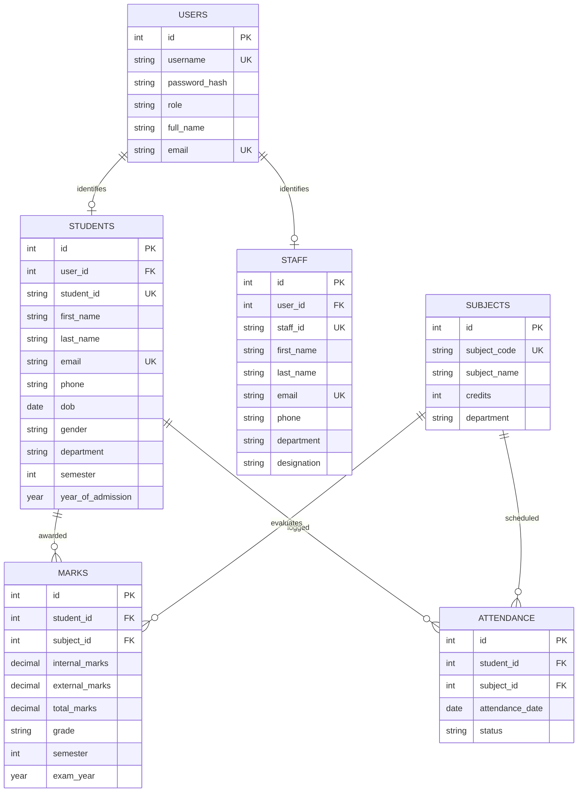

<h1 align="center">🎓 Student Information Management System</h1>

<p align="center">
  <strong>A comprehensive relational database management platform engineered with MySQL, Express.js, and an interactive institutional web portal for academic administration, mark evaluation, and attendance tracking.</strong>
</p>

<p align="center">
  
  
  
  <a href="LICENSE"></a>
</p>

---

## 🎓 Academic Background

This project was engineered as part of the **Database Management System (EGB1221)** curriculum:
- **Author**: **Albar Rahman A**
- **Department**: Electronics and Communication Engineering
- **Institution**: K. Ramakrishnan College of Technology (Autonomous), Samayapuram - 621112

---

## 🌟 Key Features

| Feature | Description |
| :--- | :--- |
| 🔐 **Role-Based Authentication** | Secure user login and registration separating administrative **Staff** privileges from **Student** self-service portals. |
| 🗄 **Normalized Relational Schema** | Third Normal Form (3NF) relational design across 6 interconnected tables (`users`, `students`, `staff`, `subjects`, `marks`, `attendance`). |
| 📊 **Staff Operations Dashboard** | Real-time institutional overview with metric cards for total students, subjects, staff members, and daily attendance records. |
| 📚 **Academic & Marks Management** | Automated evaluation tracking recording internal assessment scores, external examination marks, total score computation, and letter grading. |
| 📅 **Attendance Tracking System** | Granular date-wise and subject-wise student attendance monitoring with automated percentage computation. |
| 🖥 **Interactive Web Portal** | Responsive web interface featuring tabbed login, administrative action panels, and student report cards. |

---

## 📐 Entity-Relationship (ER) Architecture

The entity relationships mapped from the conceptual database design:



---

## 🖥 Application Interface Preview

The frontend replicates the design specifications documented in Chapter 5 of the project report:

### 1. Login Portal
```text
+---------------------------------------------------------------------------------+
|               STUDENT INFORMATION MANAGEMENT SYSTEM                             |
|                     College Management Portal                                   |
+---------------------------------------------------------------------------------+
|   [ Login ]   [ Register ]                                                      |
|                                                                                 |
|   👤 Username: [ staff1          ]                                              |
|   🔒 Password: [ ••••••••        ]                                              |
|                                                                                 |
|   [               Login to Portal               ]                               |
|                                                                                 |
|   Demo Credentials:                                                             |
|   Staff: staff1 / password                                                      |
|   Student: student1 / password                                                  |
+---------------------------------------------------------------------------------+
```

### 2. Staff Dashboard
Includes high-level statistical counters, quick action triggers (+ Add Student, Enter Marks, Mark Attendance, Manage Subjects), and recent student roster.

### 3. Student Dashboard
Provides student metrics, overall attendance progress bar (100%), quick links, and detailed subject mark breakdown (Internal, External, Total, Grade).

---

## 📁 Project Structure

```text
dbms-project/
├── sql/
│   ├── schema.sql               # Relational DDL table definitions & foreign keys
│   ├── seed.sql                 # Sample records for staff, students, marks & attendance
│   └── queries.sql              # Analytical queries (attendance %, GPA, departmental ranks)
│
├── public/
│   ├── index.html               # Login & Portal entry page (Figure 5.1)
│   ├── staff-dashboard.html     # Administrative management dashboard (Figure 5.2)
│   ├── student-dashboard.html   # Student academic portal (Figure 5.3)
│   ├── css/
│   │   └── style.css            # Responsive styles and dashboard components
│   └── js/
│       └── app.js               # Interactive frontend controller & state simulator
│
├── backend/
│   ├── server.js                # Express.js REST API server
│   ├── db.js                    # MySQL connection pool module
│   └── package.json             # Backend dependencies
│
├── .gitignore                   # Version control ignore rules
├── LICENSE                      # MIT Open Source License (Albar Rahman A)
├── CODE_OF_CONDUCT.md           # Contributor Covenant Code of Conduct
├── CONTRIBUTING.md              # Open source contribution guidelines
├── README.md                    # Comprehensive repository documentation
└── SECURITY.md                  # Security reporting policy
```

---

## 🚀 Getting Started

### Option 1: Instant Browser Demo (No Server Required)
Simply open `public/index.html` in any modern web browser:
1. Double-click `public/index.html` or run:
   ```cmd
   start public\index.html
   ```
2. Log in with the preloaded credentials:
   - **Staff**: `staff1` / `password`
   - **Student**: `student1` / `password`

---

### Option 2: Full-Stack MySQL & Node.js Setup

#### 1. Database Initialization
Import the schema and seed data into your local MySQL server:
```bash
mysql -u root -p < sql/schema.sql
mysql -u root -p < sql/seed.sql
```

#### 2. Backend Server Setup
```bash
cd backend
npm install
npm start
```
The server will start at `http://localhost:5000` with connected REST API endpoints.

---

## 🗄 Key Analytical SQL Queries

### Calculate Student Attendance Percentage:
```sql
SELECT 
    s.student_id,
    CONCAT(s.first_name, ' ', s.last_name) AS full_name,
    COUNT(a.id) AS total_classes,
    SUM(CASE WHEN a.status IN ('Present', 'Late') THEN 1 ELSE 0 END) AS attended_classes,
    ROUND((SUM(CASE WHEN a.status IN ('Present', 'Late') THEN 1 ELSE 0 END) / COUNT(a.id)) * 100, 2) AS attendance_percentage
FROM students s
LEFT JOIN attendance a ON s.id = a.student_id
GROUP BY s.id, s.student_id, s.first_name, s.last_name;
```

### Retrieve Semester Marksheet with Grades:
```sql
SELECT 
    sub.subject_code,
    sub.subject_name,
    sub.credits,
    m.internal_marks,
    m.external_marks,
    m.total_marks,
    m.grade
FROM marks m
JOIN subjects sub ON m.subject_id = sub.id
JOIN students s ON m.student_id = s.id
WHERE s.student_id = 'STU001' AND m.semester = 4;
```

---

## 📜 License

Distributed under the **MIT License**. See [`LICENSE`](LICENSE) for more details.

---

<p align="center">
  Developed with ❤️ by <a href="https://github.com/albar-rahman"><strong>Albar Rahman A</strong></a>
</p>